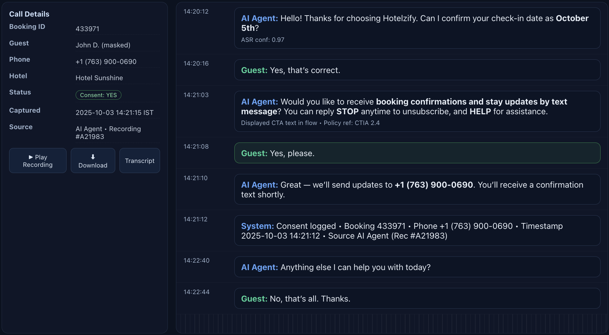
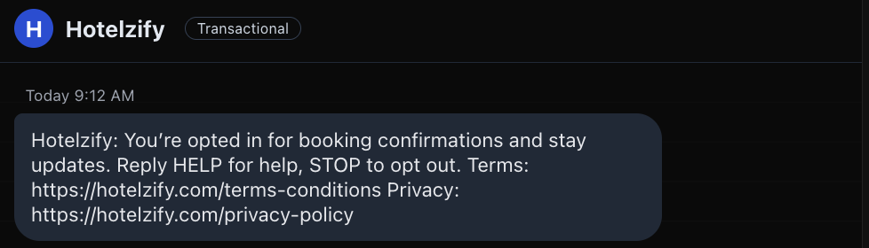

# Hotelzify - Twilio 10 DLC Verification

A Next.js app displaying SMS consent collection and compliance documentation for Twilio 10 DLC campaign registration.

## Screenshots

### SMS Consent Collection via AI Voice Agent



*Screenshot showing the AI Agent collecting explicit SMS consent during a hotel booking call. The conversation includes:*
- *Guest confirmation of check-in date*
- *Clear request for SMS consent with STOP and HELP instructions*
- *Guest providing explicit "Yes, please" consent*
- *Confirmation of phone number and consent logging*

### Opt-in Confirmation Message



*Initial opt-in confirmation SMS sent to guests after consent is collected, including:*
- *Clear opt-in confirmation*
- *HELP and STOP keyword instructions*
- *Links to Terms & Conditions and Privacy Policy*

## Running Locally

```bash
npm run dev
```

Open [http://localhost:3000](http://localhost:3000) in your browser.

## Deployment

### Deploy to Vercel (Recommended)

1. Push this code to a GitHub repository
2. Go to [vercel.com](https://vercel.com)
3. Import your repository
4. Deploy

Or use the Vercel CLI:

```bash
npm install -g vercel
vercel
```

### Deploy to Netlify

```bash
npm install -g netlify-cli
npm run build
netlify deploy --prod
```

## Sharing the Link

Once deployed, you'll get a public URL (e.g., `https://your-app.vercel.app`) that you can share with Twilio for 10 DLC verification.
